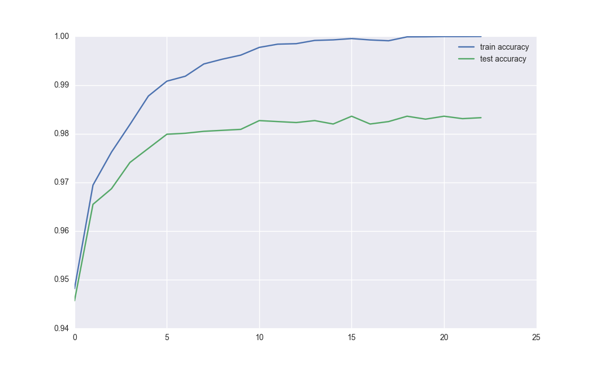

# DeepLearning
Assignments for Deep Learning Lab Course

## Exercise 1

### Task:
Implement a simple feed-forward neural network:
* Possibility to stack many layers
* Different activations for the hidden layers
* Softmax output layer
* Optimization via gradient descent (gd)
* Optimization via stochastic gradient descent (sgd)
* Gradient checking code
* Smart weight initialization
* L2 regularization

### Solution description:  
<b>Net</b>:  
* Initialized with a <b>Solver</b> and an <b>Objective</b>
* Contains list of layers from the input layer to the output layer
* Provides two possible ways of training the network:
  - Calling <b>one_iteration()</b> which makes forward pass, backward pass and at the 
  end updates network parameters using <b>Solver</b>
  - Calling <b>one_step()</b> which makes forward pass and backward pass, accumulating gradients. 
  Update on parameters is done by <b>Solver</b> only when <b>finish_iteration()</b> is called. 
  Useful when user wants to do full batch gradient descent but there is too much data to fit 
  into the memory at once.

<b>Layer</b>:  
* Constructed with an <b>Activation</b> function and <b>WeightInit</b> method
* Implements single layer which is later trained using <b>Net</b> class
* Makes it possible to accumulate gradients over single passes and to average it 
before update on parameters is done.

<b>Solver</b>:
* Different solvers implement different methods to update network parameters
* Simple solver just updates the network parameters using current gradients and
learning rate
* Momentum solver uses momentum to accelerate the training process

<b>Objective</b>:
* Implements loss function together with its derivative
* <b>Squared</b> and <b>SoftmaxLikelihood</b>(should be used with <b>Softmax</b> activation only) 
are implemented

<b>Activation</b>:
* Activation that is used in a layer
* Provides implementation of forward and backward pass for activation function
* Implemented are: 
  - Sigmoid
  - Tahn
  - ReLU
  - LeakyReLU
  - Linear (Identity)
  - Softmax
  
<b>WeightInit</b>:
* Used by <b>Layer</b> for weight initialization
* Implemented are: 
  - Gaussian initialization
  - Xavier gaussian initialization 
  - Xavier uniform initialization
  
Some other functionalities:
  - Saving and loading the network from file
  - Saving and loading the results (training and validation) (loss and accuracy)
  - Script to display plots of results-
  - Function to provide random batch and function to generate full batch in chunks
  - Scripts to train networks with random hyperparameters
  - Script to check gradients implementation
  
### Experiments:  
Performance of random configurations was checked using random_train.py script.
Each random network was trained for 20 minutes. During the training, network from epoch
with the lowest validation loss was saved. The best network found had 98,3% accuracy on
the validation set. It was 1 layer (875 neurons) network. Probably 20 minutes was not
enough for networks with more layers. 

Later script train.py was used to check other
configurations, training was stopped manually for each network when no more progress was
observed. At the end network with 900, 450 neurons in hidden layers was used. L2 regulation
was turned off. Network was finally retrained on training and validation datasets. 
Achieved accuracy on test dataset was <b>98,25%</b>.

   

 

  Fig 1. Accuracy on train and test dataset

 

## Exercise 2

### Task
Implement a simple convolutional network for face attribute classification using the 
Lasagne framework. Work with a dataset called celebA, which contains about 200K images
of celebrities with 40 annotated visual attributes (gender, hair color, glasses
etc.). Use a simplified version of the dataset, where images are aligned,
cropped and downsampled to the size of 32x32 for making the training procedure
faster. The dataset is already split into three subsets: training,
validation and test. Use the training set for optimizing the weights of the
network, the validation set for checking the network performance on unseen
data and selecting the hyperparameters, and the test set for final evaluation.

- Task A:
Implement a gender classifier (attribute name ”Male”). The
network should get an input image and decide if the person in the image is
male or female. Figure out some reasonable architecture. Compare at least two
optimization algorithms (e.g. SGD and Adam).

- Task B:
Modify the last layer of the network from the previous task such that it outputs
a full list of 40 attributes. Not the change in final accuracy of gender prediction 
compared to Task 1.

- Task C:
Visualize the filters of the first convolutional layer of your network. 

